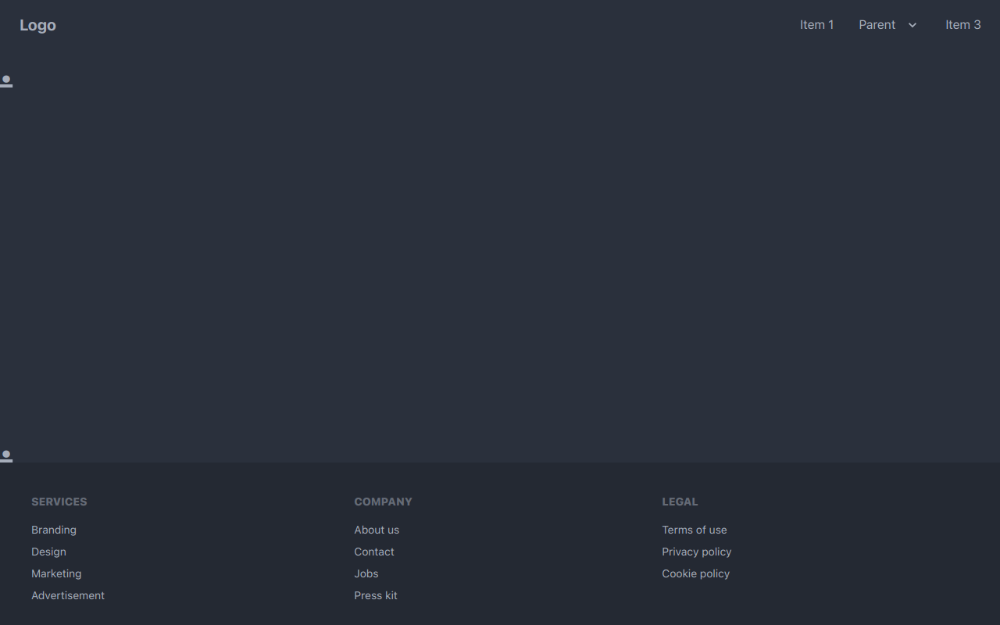

## About
This is a [Next.js](https://nextjs.org/) start template that includes [TypeScript](https://github.com/microsoft/TypeScript), [Tailwind CSS](https://tailwindcss.com/), and [Daisy UI](https://daisyui.com/). <br />I could not find one that was minimal & clean, so I made one.
<br />
## Installed + Setup

✅  Next.js <br />
✅  TypeScript <br />
✅  Tailwind CSS <br />
✅  Daisy UI<br />
## Install
```bash
git clone https://github.com/jesusyanez/nextjs-typescript-daisyui-starter.git
cd nextjs-typescript-daisyui-starter
npm install
```
## Getting Started

First, run the development server:

```bash
npm run dev
# or
yarn dev
```

Open [http://localhost:3000](http://localhost:3000) with your browser to see the result.

You can start editing the page by modifying `pages/index.tsx`. The page auto-updates as you edit the file.

[API routes](https://nextjs.org/docs/api-routes/introduction) can be accessed on [http://localhost:3000/api/hello](http://localhost:3000/api/hello). This endpoint can be edited in `pages/api/hello.ts`.

The `pages/api` directory is mapped to `/api/*`. Files in this directory are treated as [API routes](https://nextjs.org/docs/api-routes/introduction) instead of React pages.

## Learn More
### Next.js - The React Framework for Production.

- [Next.js Documentation](https://nextjs.org/docs) - learn about Next.js features and API.
- [Learn Next.js](https://nextjs.org/learn) - an interactive Next.js tutorial.

You can check out [the Next.js GitHub repository](https://github.com/vercel/next.js/) - your feedback and contributions are welcome!

### DaisyUI - The most popular, free and open-source Tailwind CSS component library.
- [Official DaisyUI GitHub](https://github.com/saadeghi/daisyui) - view the official github repo
- [Documentation](https://github.com/saadeghi/daisyui) - [Themes](https://daisyui.com/docs/themes) - [Components](https://daisyui.com/components)

### Tailwind CSS - A utility-first CSS framework for rapid UI development.
- [Official Tailwind CSS GitHub](https://github.com/tailwindlabs/tailwindcss) - view the official github repo
- [Documentation](https://tailwindcss.com/docs/installation)


## Deploy on Vercel

The easiest way to deploy your Next.js app. By [Vercel](https://vercel.com/new?utm_medium=default-template&filter=next.js&utm_source=create-next-app&utm_campaign=create-next-app-readme), creator of Next.js.
1. Login with GitHub
2. Select repo
3. Click deploy 

When you push to repo Vercel rebuilds, deploys, and automatically updates the site.
